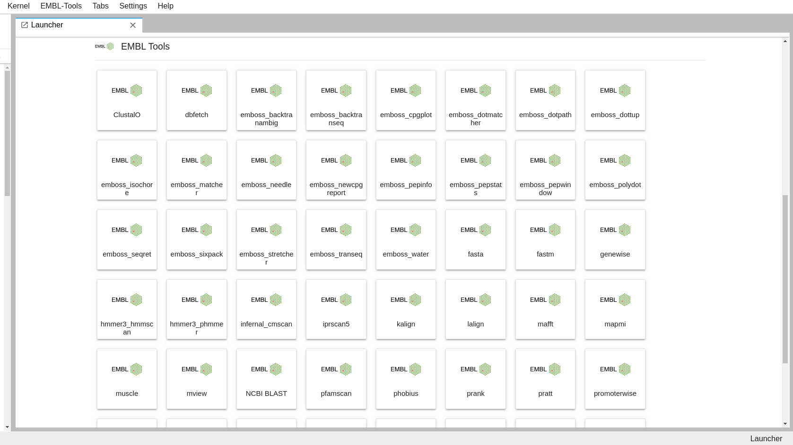

# embl-tools-jl


### Copyright (c) 2020, Dr. Nandor Poka
### Distributed under the terms of the 3-clause BSD License.

An extension adding Launcher shortcuts to JupyterLab for EMBL Tools.

This extension is composed of a Python package named `embl_tools_jl`
for the server extension and a NPM package named `embl-tools-jl`
for the frontend extension.

## Preview



## Requirements

* JupyterLab >= 2.0
* [EMBL-Tools](https://github.com/nandor-poka/embl_tools) installed and accessible from Jupyterlab root path (where JupyterLab has been started from. 
The extension will not put icons to the Launcher if the EMBL-Tools is not found in the directory tree.

**Scanning for the tools can take long and thus delay the startup of JupyterLab. It is recommended to put EMBL-Tools in the root of your regular work directory you use JupyterLab in.**

## Install

Note: You will need NodeJS to install the extension.

```bash
pip install embl_tools_jl
jupyter lab build
```

## Troubleshoot

If you are seeing the frontend extension but it is not working, check
that the server extension is enabled:

```bash
jupyter serverextension list
```

If the server extension is installed and enabled but you are not seeing
the frontend, check the frontend is installed:

```bash
jupyter labextension list
```

If it is installed, try:

```bash
jupyter lab clean
jupyter lab build
```

## Contributing

### Install

The `jlpm` command is JupyterLab's pinned version of
[yarn](https://yarnpkg.com/) that is installed with JupyterLab. You may use
`yarn` or `npm` in lieu of `jlpm` below.

```bash
# Clone the repo to your local environment
# Move to embl-tools-jl directory

# Install server extension
pip install -e .
# Register server extension
jupyter serverextension enable --py embl_tools_jl

# Install dependencies
jlpm
# Build Typescript source
jlpm build
# Link your development version of the extension with JupyterLab
jupyter labextension link .
# Rebuild Typescript source after making changes
jlpm build
# Rebuild JupyterLab after making any changes
jupyter lab build
```

You can watch the source directory and run JupyterLab in watch mode to watch for changes in the extension's source and automatically rebuild the extension and application.

```bash
# Watch the source directory in another terminal tab
jlpm watch
# Run jupyterlab in watch mode in one terminal tab
jupyter lab --watch
```

### Uninstall

```bash

pip uninstall embl_tools_jl

jupyter labextension uninstall embl-tools-jl
```
